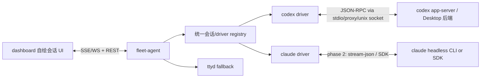

# Desktop-backed Claude / Codex 自绘会话 UI — 设计

日期：2026-07-16 · 状态：PM 研究完成，待 `$dev` 实现 POC

> 当前消息投递、writer、access 与队列生命周期已由 `../superpowers/specs/2026-08-13-codex-server-authoritative-chat-design.md` 取代；下文保留早期 UI/协议研究背景。

## 背景与问题

当前 dashboard 的 Claude / Codex 会话交互走的是：

1. `fleet-agent` 扫本机会话库列出会话。
2. 用户打开会话时，`fleet-agent` 在 tmux 里启动 `claude --resume` 或 `codex resume`。
3. dashboard 通过 ttyd iframe 显示 TUI，并把输入注入 ttyd/xterm。

这条链路稳定，因为 CLI/TUI 自己处理所有复杂交互；但它把产品体验绑死在终端上：

- 消息流、工具调用、diff、审批、等待用户输入都只能作为终端文本呈现。
- 移动端输入体验差，需要额外的虚拟按键和 paste 注入。
- 多窗口池消耗 pty，需要额外回收策略。
- dashboard 很难做出 Claude Desktop / Codex Desktop 那种结构化交互。

用户接受 Desktop 或 CLI/终端承接，只要求会话共享；优先使用 Desktop 相关后端，CLI/headless 作为稳定兜底。

## 目标 / 非目标

**目标**

- G1：为 Codex 优先接入 Desktop/IDE 使用的 `codex app-server`，实现不依赖 ttyd 的自绘会话 UI POC。
- G2：保留现有会话列表、项目分组、权限模式选择、终止/回到终端等能力。
- G3：前端消费统一的结构化事件，而不是终端屏幕输出。
- G4：Claude 方案先明确接口边界，为第二阶段接入 Desktop 会话库 + headless CLI/SDK 留好抽象。
- G5：ttyd/TUI 继续作为 fallback，不在 POC 阶段删除。

**非目标**

- 不直接写 Claude/Codex JSONL 会话文件。
- 不解析 TUI 文本来构造消息流。
- 不试图让 Claude 和 Codex 共用同一个底层协议；只在 `fleet-agent` 对前端暴露统一投影。
- POC 不重做整个 dashboard 信息架构，只替换右侧终端区域的 Codex 会话体验。
- POC 不暴露 Codex app-server 的 websocket 到公网或浏览器。

## 研究结论

### Codex：优先 Desktop/app-server

本机已经存在可用的 `codex app-server` daemon：

```text
~/.codex/app-server-control/app-server-control.sock
```

`codex app-server` 是 Codex rich interfaces 的后端，协议是 JSON-RPC 2.0 风格（wire 上省略 `"jsonrpc":"2.0"`），支持 stdio、unix socket、websocket 等 transport。其中 websocket 被文档标注为 experimental / unsupported，不应作为生产浏览器直连方案。

核心模型：

- Thread：会话。
- Turn：用户一次输入到模型完成的一轮。
- Item：消息、推理、命令、文件改动、工具调用等持久化条目。

关键方法/事件：

- `initialize` + `initialized`
- `thread/list`
- `thread/read`
- `thread/start`
- `thread/resume`
- `turn/start`
- `turn/interrupt`
- `turn/steer`
- `item/agentMessage/delta`
- `item/started`
- `item/completed`
- `item/commandExecution/requestApproval`
- `item/fileChange/requestApproval`
- `item/fileChange/patchUpdated`
- `item/commandExecution/outputDelta`
- `turn/completed`
- `thread/status/changed`

实现建议：`fleet-agent` 本机连接 app-server 的 stdio/proxy/unix socket，自己把事件转为 dashboard SSE/WS。不要让浏览器直连 app-server。

参考：

- Codex app-server README: https://github.com/openai/codex/blob/main/codex-rs/app-server/README.md
- 本机探针：`codex app-server` 可完成 `initialize -> thread/list`。

### Claude：Desktop 会话库 + headless CLI/SDK

Claude Desktop 可作为会话元数据来源：

```text
~/Library/Application Support/Claude/claude-code-sessions
```

项目当前已经使用它作为 Claude 会话列表的一次数据源，能拿到 Desktop 标题、cwd、归档状态、cliSessionId 等信息。

但当前未确认存在与 Codex app-server 等价、公开、稳定的 Claude Desktop 控制面。更稳的第二阶段方案：

- 继续用 Desktop session store 列会话。
- 发送消息/恢复会话时，用 Claude Code headless 模式承接：
  - `claude -p --input-format stream-json --output-format stream-json --resume <session>`
  - 或 Claude Agent SDK 的 `ClaudeSDKClient`。
- 将 stream-json/SDK message 映射到同一套前端事件模型。

注意：Claude Agent SDK 官方文档主推 API key 认证；如果目标是复用用户本机 Claude Desktop/Claude Code 登录态，需要单独做兼容实证。CLI headless 更贴近“本机安装 CLI，复用本机会话”的要求。

参考：

- Claude Agent SDK overview: https://code.claude.com/docs/en/agent-sdk/overview.md
- Claude Python SDK reference: https://code.claude.com/docs/en/agent-sdk/python.md
- Claude CLI reference: https://code.claude.com/docs/en/cli-reference.md

## 总体架构



### `fleet-agent` 新增抽象

新增一个 `ChatDriver` 级别的内部抽象，避免前端认识 Claude/Codex 的底层差异：

```go
type ChatDriver interface {
	List(ctx context.Context, scope string) ([]Session, error)
	Read(ctx context.Context, sessionID string) (ChatSnapshot, error)
	Start(ctx context.Context, req ChatStartRequest) (ChatSession, error)
	Resume(ctx context.Context, sessionID string, opts ChatOptions) (ChatSession, error)
	Send(ctx context.Context, sessionID string, input ChatInput) error
	Approve(ctx context.Context, req ApprovalDecision) error
	Interrupt(ctx context.Context, sessionID string) error
	Subscribe(ctx context.Context, sessionID string) (<-chan ChatEvent, error)
}
```

POC 可以先只实现 Codex driver 的最小子集：

- `List`
- `Read`
- `Start`
- `Resume`
- `Send`
- `Subscribe`
- 基础 approval response

Claude driver 可以先保留旧实现或返回 `unsupported`，前端显示“用终端打开”。

## 前端统一事件模型

`fleet-agent` 对 dashboard 暴露自家稳定事件，不把 app-server/Claude 原始事件原样泄漏给前端。

建议 SSE 起步；需要双向低延迟/多 pending approval 时再升级 WS。发送用户输入和审批仍走 REST。

### 事件类型草案

```json
{ "type": "thread_status", "sessionId": "...", "status": "running|idle|blocked|error" }
{ "type": "user_message", "id": "...", "text": "...", "createdAt": 123 }
{ "type": "assistant_delta", "itemId": "...", "delta": "..." }
{ "type": "assistant_done", "itemId": "...", "text": "..." }
{ "type": "tool_start", "itemId": "...", "name": "shell|edit|mcp", "title": "...", "input": {} }
{ "type": "tool_delta", "itemId": "...", "stream": "stdout|stderr|log", "delta": "..." }
{ "type": "tool_done", "itemId": "...", "status": "ok|error|cancelled" }
{ "type": "diff_update", "itemId": "...", "files": [{ "path": "...", "patch": "..." }] }
{ "type": "approval_request", "approvalId": "...", "kind": "command|file_change|permission", "summary": "...", "detail": {} }
{ "type": "approval_resolved", "approvalId": "...", "decision": "approved|denied|abort" }
{ "type": "turn_done", "turnId": "...", "usage": {} }
{ "type": "error", "message": "..." }
```

### REST/SSE API 草案

在现有 `/api/*` 下新增，不破坏 `/api/open` 和 `/api/new`：

```text
GET  /api/chat/sessions?assistant=codex|claude&scope=active|all
GET  /api/chat/thread?assistant=codex|claude&sessionId=...
POST /api/chat/start       {assistant,cwd,mode}
POST /api/chat/resume      {assistant,sessionId,mode}
POST /api/chat/input       {assistant,sessionId,text,clientMessageId?}
POST /api/chat/steer       {assistant,sessionId,text,images?}
POST /api/chat/approve     {assistant,sessionId,approvalId,decision}
POST /api/chat/interrupt   {assistant,sessionId,turnId?}
GET  /api/chat/events?assistant=codex|claude&sessionId=...
```

POC 可以先做 Codex：

```text
POST /api/chat/resume
POST /api/chat/input
GET  /api/chat/events
```

会话列表仍可复用现有 `/api/sessions?assistant=codex`，等 POC 稳定后再统一。

### 运行态与追问队列

- 浏览器只投影 fleet-agent 返回的完整控制快照；SSE 生命周期事件只触发重新取快照，不直接驱动 `running / idle` 或 writer。
- Codex Desktop 的默认 follow-up mode 仍是 `steer`，但浏览器只向 `/api/chat/queue` 提交 `deliveryMode=auto`；由 agent 在活跃 Fleet turn 上 steer，否则 start。
- Cmd/Ctrl+Shift+Enter 提交 `deliveryMode=next`，消息进入目标 Mac 服务端按 session 隔离的 FIFO 队列。
- steer/start 竞态、失败恢复、client message 对账和 turn 完成后的续投都由 fleet-agent 处理；浏览器只保留 optimistic 气泡与按钮 pending 反馈。
- queue item 的“引导”、取消、重试与接管全部调用服务端 decision API；返回服务端结果并重新同步后再更新 UI。

完整协议和验收基线见 `codex-app-server-refactor.md`。

## Codex driver 设计

### 连接策略

优先顺序：

1. 连接已运行 managed daemon 的 unix socket：
   `~/.codex/app-server-control/app-server-control.sock`
2. 若 socket 不存在，执行：
   `codex app-server daemon start`
3. 若 daemon 管理不可用，退回启动独立 stdio：
   `codex app-server`
4. 若 app-server 整体不可用，前端显示 fallback：“用终端打开”。

不要使用 `--listen ws://` 作为生产路径。

### JSON-RPC 生命周期

每个 `fleet-agent` 到 app-server 的连接：

1. 发送 `initialize`：

```json
{
  "method": "initialize",
  "id": 1,
  "params": {
    "clientInfo": {
      "name": "mac_fleet_hub",
      "title": "mac-fleet-hub",
      "version": "<agent version>"
    }
  }
}
```

2. 收到 response 后发 notification：

```json
{ "method": "initialized" }
```

3. 执行 `thread/list` / `thread/resume` / `turn/start`。
4. 读取 notifications，按 `threadId` 分发给订阅该 session 的前端连接。

### 方法映射

| 前端意图 | Codex app-server |
|---|---|
| 列会话 | `thread/list` |
| 读取历史 | `thread/read` with `includeTurns` |
| 新会话 | `thread/start` then `turn/start` |
| 继续会话 | `thread/resume` then `turn/start` |
| 输入消息 | `turn/start`（无 active turn）或 `turn/steer`（active turn） |
| 中断 | `turn/interrupt` |
| 审批命令 | response to server request `item/commandExecution/requestApproval` |
| 审批文件变更 | response to server request `item/fileChange/requestApproval` |
| 命令输出 | `item/commandExecution/outputDelta` |
| 文本输出 | `item/agentMessage/delta` |
| diff | `item/fileChange/patchUpdated` |

### 权限模式映射

沿用现有 dashboard 三档：

- default：不覆盖 app-server 默认配置。
- auto：`approvalPolicy=never` + workspace-write 等价配置（需按 schema 最终确定字段）。
- bypass：full access / bypass approvals。必须保留醒目风险提示。

实现时以 `codex app-server generate-ts` 或 `generate-json-schema` 的当前版本 schema 为准，不凭记忆写字段。

## Claude driver 设计（第二阶段）

### 目标

在不依赖 ttyd 的情况下，让 dashboard 自绘 Claude 会话，但仍与 Desktop/CLI 会话共享。

### 优先方案

1. 列会话：继续复用现有 Desktop store 扫描：
   `~/Library/Application Support/Claude/claude-code-sessions/*/*/local_*.json`
2. 承接会话：
   `claude -p --input-format stream-json --output-format stream-json --resume <sessionId>`
3. 解析 stream-json：
   - assistant 文本 delta
   - tool use / tool result
   - permission / question
   - final result
4. 写回/共享：由 Claude CLI 自己维护 JSONL 和 Desktop 可见状态。

### 备选方案

Claude Agent SDK `ClaudeSDKClient` 更适合长期自绘 UI，但需要确认是否能复用用户本机 Claude Code 登录态/订阅。若只能 API key，则作为可选模式，不作为“Desktop 优先”的默认实现。

## Dashboard UI 设计要求

POC 只替换右侧终端 pane，不重写整个 dashboard。

必备状态：

- 空态：选择一个会话。
- 历史加载中。
- 会话未连接/可恢复。
- 正在运行 turn。
- 等待审批。
- 等待用户输入。
- 命令执行中。
- 文件 diff 可展开。
- turn 完成。
- 错误 + fallback 到终端。

基础布局：

- 左侧会话列表继续使用现有结构。
- 右侧新增 `chat-pane`，和现有 `frames`/`empty-state` 并存。
- 顶部显示 Mac、assistant、项目、权限模式。
- 中间消息流。
- 底部 composer。
- 工具/命令/diff 用可折叠卡片，不用终端文本伪装。

移动端：

- 不再需要 ttyd 的移动输入辅助。
- composer 固定底部，审批卡优先显示。
- 长命令输出默认折叠，避免撑爆屏幕。

## 安全与运维

- app-server 只由 `fleet-agent` 在本机连接，不直接暴露到 nginx 或浏览器。
- 前端所有请求仍走现有网关、Authelia、Headscale ACL。
- 审批请求必须在 UI 上明确展示命令、cwd、文件路径、风险模式。
- bypass 模式沿用现有警告，不新增静默高危入口。
- fallback 到 ttyd 必须一直可用，直到自绘 UI 覆盖主要路径并验证稳定。

## 验收标准

Codex POC 完成条件：

- 可以列出 Codex Desktop 会话。
- 可以打开一个已有 Codex 会话并渲染历史或至少开始接收新 turn 事件。
- 可以从自绘输入框发送一条消息。
- assistant 文本以流式方式显示。
- 命令执行输出以结构化卡片显示。
- 出现命令/文件审批时，UI 可以批准/拒绝，并让 turn 继续或停止。
- Codex Desktop/CLI 仍能看到同一会话记录。
- app-server 不可用时，UI 能回退到现有 ttyd 打开方式。

Claude 第二阶段完成条件：

- 可以从 Desktop 会话库列出 Claude 会话。
- 可以通过 headless CLI 恢复会话并发送消息。
- 自绘 UI 能显示 assistant 文本和基本工具结果。
- Claude Desktop/CLI 能看到同一会话历史。
- 不可用时回退到 ttyd。

## 风险

- Codex app-server API 虽有 README 和 schema，但部分字段仍 experimental；实现必须按本机 `generate-json-schema` pin 当前版本，并在启动时校验 CLI/app-server 版本。
- Claude Desktop 没有确认公开控制面；不要承诺第一阶段完成 Claude 自绘。
- 多前端同时订阅同一 thread 需要分发和取消订阅管理，POC 可先支持单浏览器连接。
- 权限模式字段映射如果写错，可能导致静默无审批或无法写文件；必须单测和手测。
- 长输出、diff、大文件变更需要虚拟化或折叠；POC 先折叠和截断。
