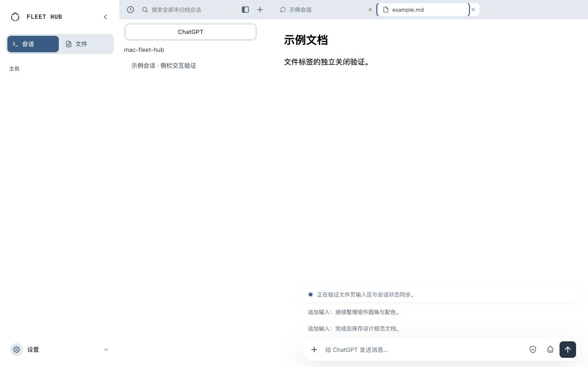
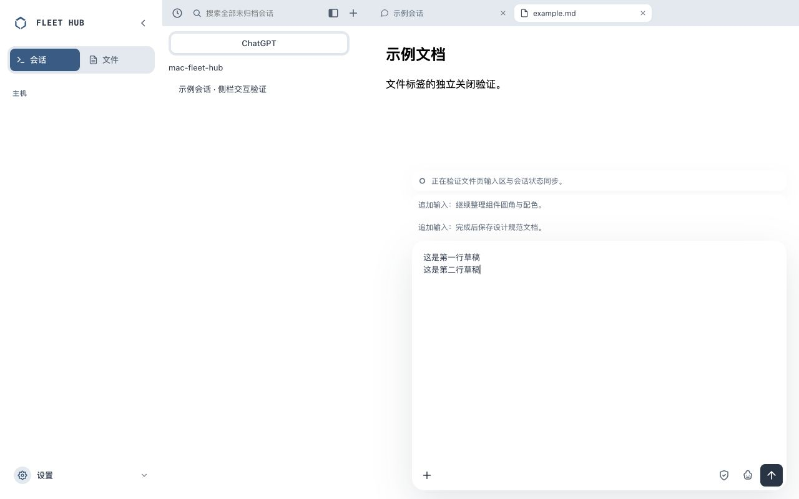
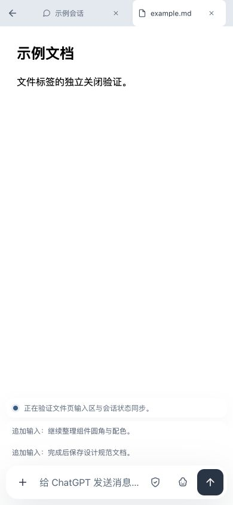

# 非聊天 Tab 的共享输入区

实现范围：已打开会话的文件预览 Tab。沿用原会话、同一 textarea、附件上传、权限/模型菜单、发送/追加/停止行为及队列操作，不创建另一份输入状态。

- 收起时右下角 600px 最大宽度、48px 单行输入区，顺序为附件 +、输入、权限图标、模型图标、发送按钮。
- 聚焦输入展开至 50dvh，失焦立即收起；多行草稿保留。底部按钮位置稳定，失焦后仍可点击菜单。
- 主会话输出显示最近一个非空文本行；工具、用户输入和 reasoning 不当作输出摘要。正在运行显示灰色旋转圈，完成的新输出显示未读标记并保持最后一行。点击摘要返回聊天。
- 复用原追加输入队列，每条一行，多条排列；保留原编辑/引导/取消操作。
- 文件 Tab 下始终隐藏 Sub Agent 面板，切回聊天恢复。
- 文件 Tab 下完成输出不自动标记已读；返回可见聊天后确认已读。切换会话覆盖摘要，退出账号清空摘要。
- 移动端沿用安全区，控件 44×44px。

## 本地验证证据

`bash scripts/verify.sh` 退出码 0：Go 两层通过；网页 303 项通过、0 失败；候选包装 13 通过、1 跳过；Swift 43 通过、0 失败；全部 shell 检查通过。原始输出：[verify.txt](verify.txt)。

新增组件回归覆盖：最新主会话输出筛选、聚焦/失焦与多行草稿保留、完成后未读保持及返回确认、关闭/隐藏窗口不确认已读、会话切换/退出清理。另补选中会话被文件 Tab 覆盖时仍显示未读，以及鉴权失效清空摘要的回归。

Chrome 隔离预览实际观测：

- 1280×800：输入卡宽 600px、收起高 48px；5 个控件同 y=744，附件最左、发送最右；聚焦高 400px，失焦回到 48px，多行草稿保持。
- 输出摘要 `running` 使用旋转圈；完成为 `unread`，点击返回后隐藏摘要并恢复聊天/Sub Agent。
- 同时展示两条追加输入，Sub Agent 计算样式为 `display:none`。
- 390×844：页面 scrollWidth=390，无横向溢出，全部动作控件 44×44px；聚焦高 422px；点击 iframe 文档后收起。

浏览器使用隔离静态夹具验证布局和组件交互，未连接真实设备、未发送真实消息或上传文件。真实发送链路继续复用已有应用逻辑，当前结果不冒充生产消息验证。

当前 AGENTS.md 限定源码及独立本地验证：本次没有生产部署，没有替换 Mac、LaunchAgent 或 Desktop，也没有修改生产网络。

## 效果图

