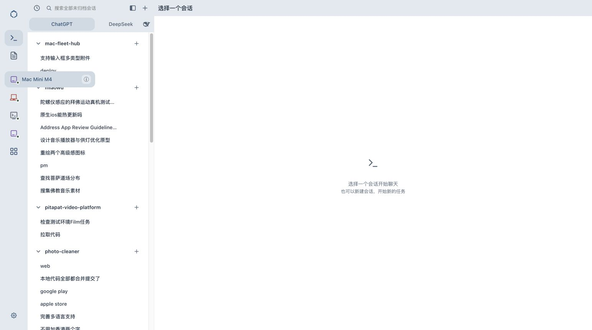

# 收起设备项悬浮展开 · v179

2026-10-07 已上线，发布提交 `5d8eebf`。

## 行为

收起设备栏、桌面支持精确 hover 时，仅当前设备项从原图标位置向右展开。使用原设备图标、名称、在线状态、选中底色、12px圆角和设置入口，背景与展开侧栏一致。宽度与文字透明度使用相同 `--dur-2`（220ms）与 `--ease`；图标位置不动。

鼠标可以移到设置按钮，点击打开对应设备设置；点击行选择设备，离开收回。Esc、列表滚动、视口变化、侧栏展开、设备行重绘和点击外部会关闭。键盘聚焦设备也能呼出，触屏不触发悬停；减少动态效果偏好取消动画。全部设备项保留原行为。

## 自动验证

新增6个行为测试，覆盖指针从源项移到设置、设置不误选设备、选择原设备、收回动画、触屏与展开侧栏禁用、Esc/滚动/源移除/侧栏展开关闭、快速离开时不被待执行动画重新打开。首次5项因未实现模块失败，完成实现后6项通过。

`bash scripts/verify.sh`：Go通过，Dashboard 265项通过、0失败，所有脚本层通过。[完整输出](verify.txt)。

## 实际发布与浏览器

不可变提交静态归档109个文件SHA256全部匹配；运行时设备数据存在，nginx/fleet-enroll/headscale/fleet-nodes.timer 全部active，缓存fleet-shell-v179。备份 `/var/backups/mac-fleet-hub/dashboard-before-v179-20261007T061509Z.tgz`。[部署回执](deploy.txt)。

已登录线上在收起设备栏的 Mac Mini M4 验证：浮层236×42px，圆角12px，transitionDuration 0.22s，名称透明度1；原图标与浮层图标 x 均25。鼠标从图标移到设置保持展开；设置打开真实 Mac Mini M4 设置页，再取消未保存。按Esc确认浮层不存在。未发送消息、修改设备设置或操作文件。

