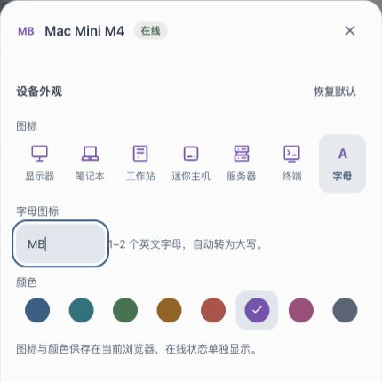

# 设备文字图标

设备设置 → 图标 → 文字。支持 1–2 个 ASCII 英文字母或数字，可混合输入（如 4、04、A1），保留前导零，字母自动大写；保存后替代 SVG，沿用设备配色和独立在线状态。原六种 SVG 仍可选择。偏好仍保存在当前浏览器。数字支持仅源码与独立本地验证，未部署生产。

空内容、超过两位、标点、中文及非 ASCII 字符阻止保存；换色保留当前输入；取消不改变原图标，切回 SVG 清除文字设置。

## 字母图标 v180 生产发布记录

2026-10-07 用户明确追加“上线”授权后，从独立发布分支提交 `98d1de3` 发布 https://fleet.hyposomnia.top:20443/ 。本次仅 Web 静态资源，不包含共享工作区的多用户或原生客户端变更。

发布前完整 `bash scripts/verify.sh` 通过，Dashboard 270/270、Go agent/enroll、shell 检查均成功：[release-verify.txt](release-verify.txt)。共享开发分支此前的完整验证另外为 Dashboard 314/314，含更多开发中测试。

按不可变提交 git archive 发布，109 个文件 SHA 全部匹配。保留运行时 api/nodes.json，nginx、fleet-enroll、headscale、fleet-nodes.timer 均 active，未重启服务。备份路径及真实输出见 [deploy.txt](deploy.txt)。

浏览器线上验证：mb → MB、换色保留输入、M1 禁用保存、取消保留原 SVG；保存后设备文字 MB、SVG 数量 0、在线标记保留，刷新仍为 MB，收起栏悬浮设备项也显示 MB。测试后已通过界面恢复原“迷你主机 / 紫罗兰”外观及收起设备栏状态。

