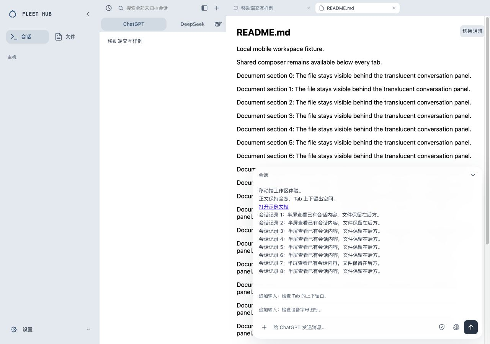
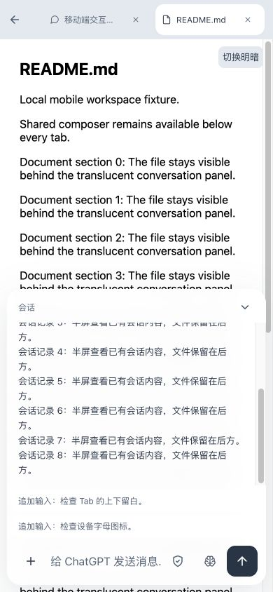

# 文件 Tab 半屏会话

2026-10-07，替换原“输入框半屏增高”的交互。v183发布记录见下文；后续原位展开、阴影和三处半透明修正仅完成源码与本地验证，分别见 anchor-fix/、input-shadow/、floating-glass/。

## 行为

- 最近输出摘要与顶部最近输入、跳到底部按钮共用浮层半透明配方：主题 surface-2 的 72%、18px 背景模糊、无边框、统一圆角；展开正文面板仍为 94% 主题表面。
- 点击摘要或聚焦输入，原地在文件上方显示半屏会话；当前文件 Tab 和 iframe 保持，复用原会话正文、草稿与发送入口。
- 面板包含可滚动的会话正文，输入初始一行，随实际内容增高，上限180px后内部滚动；空草稿的提示不会撑高输入。
- 收起按钮、Escape、点击或聚焦面板外部（包括文件 iframe）收起；在正文、权限、模型和发送控件之间移动焦点保持展开。模型/权限菜单优先处理Escape。
- 原地展开时确认已读；背景文件页和隐藏浏览器不确认；切换会话或清理会话关闭面板并清理摘要。
- 追加输入继续逐条显示，文件模式隐藏 Sub Agent。

## 实现与验收

复用 `compact_composer.js` 的展开状态，CSS定位现有 `#chat-pane`，不创建第二份会话或输入框。`#chat-scroll` 展开时解除 inert，收起时恢复。PWA 外壳 v183。

回归先失败后通过：摘要不再切回聊天Tab、内部/外部焦点、关闭与Escape、已读、会话切换清理，以及空草稿/多行/长草稿高度。

完整 `bash scripts/verify.sh` 退出0：Dashboard 274/274，Go agent/enroll与shell/shared安装/空闲守卫/自更新/nginx/变量/API重试层通过，原始输出见 [verify.txt](verify.txt)。

本地真实CSS/组件与虚构内容检查：1280×900桌面明暗、390×844手机明暗、320×740窄屏。面板分别450/422/370px；空输入36px桌面、44px手机；手机摘要与收起按钮至少44px，无横向溢出。三行草稿动态增高、收起保留、Escape恢复摘要焦点、文件iframe点击收起，控制台warning/error为0。浏览器模拟不代表真实iOS键盘或PWA安全区验收。

## 发布与线上验收

Web v183 已从不可变源码提交 `b701026` 发布；运行配置与 Mac 客户端未修改，未重启服务。原始发布输出见 [deploy.txt](deploy.txt)，脚本见 [deploy.sh](deploy.sh)，静态 SHA 清单见 [static.sha256](static.sha256)。

- 已备份旧静态文件：`/var/backups/mac-fleet-hub/dashboard-before-v183-20261007T113740Z.tgz`。
- 109 个线上静态文件 SHA 匹配，动态 `api/nodes.json` 保留。
- nginx、fleet-enroll、headscale、fleet-nodes.timer 均为 active。
- 公网未认证 HTTP 返回 302 至既有认证入口，见 [http.txt](http.txt)。
- 真实线上 Chrome 桌面 1516×917：最近输出有半透明底色与16px blur，点击原地展开正文，README 文件 Tab 保持选中；输入36px，面板458.5px。模型菜单操作保持面板，Escape先关闭菜单。
- 真实线上 Chrome 手机视口390×844：摘要点击与输入聚焦均展开，面板422px，输入与收起按钮44px；收起后文件仍选中，无横向溢出，控制台warning/error为0。
- 未发送测试消息、未改动模型或权限，未进行真实iOS键盘/PWA验收。含真实会话的线上截图仅保存在本机临时目录；仓库截图使用虚构内容。
