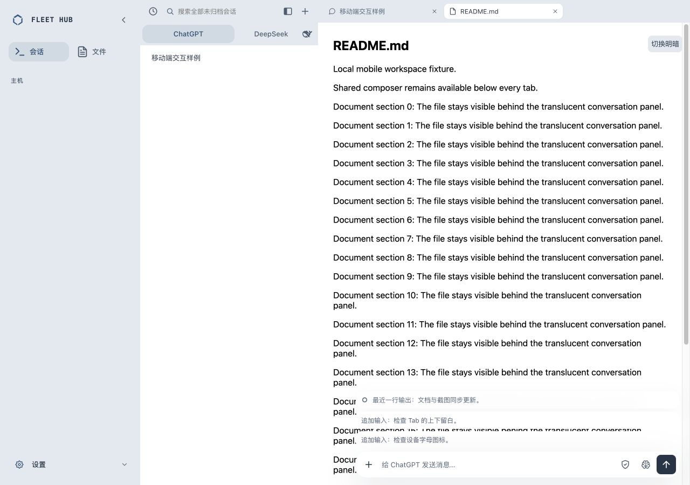
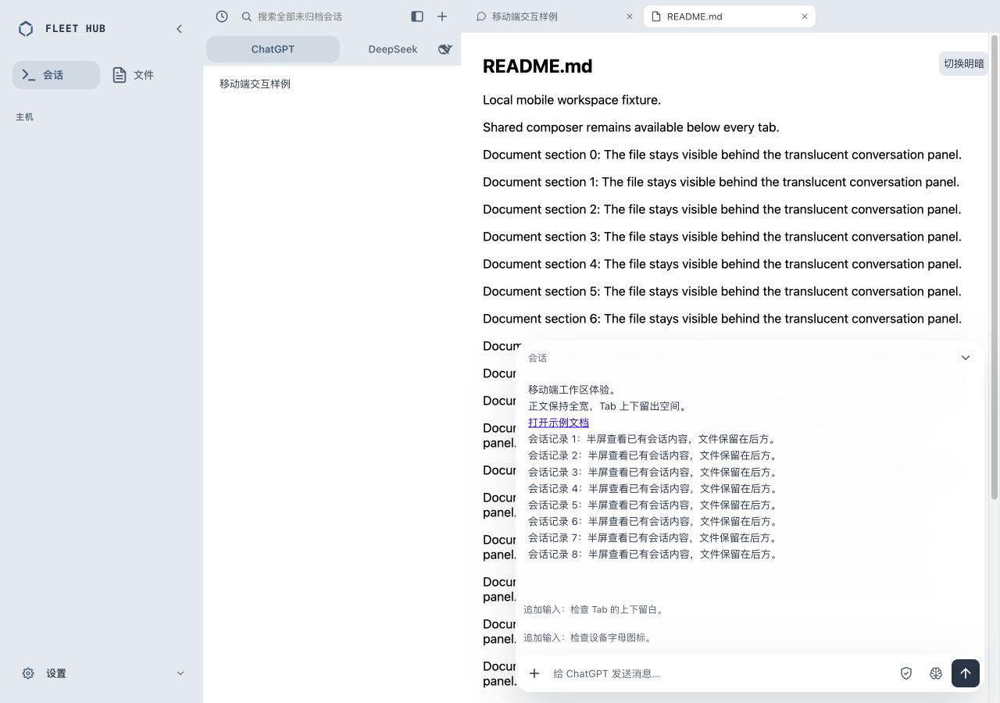

# 会话输入区原位展开修正

2026-10-07，针对展开后输入区位置和底色变化的反馈。

原因：展开态额外增加6px外层padding，且清除了原输入区底色；整块面板还使用带位移/缩放的opop动画。

修正：展开态外层padding恢复0，保持原输入区底色、圆角和阴影；以向上揭示替代整块位移/缩放，支持减少动态效果。仅会话正文从现有输入区上方展开，文件Tab与草稿保留。

实测：本地真实CSS与共享组件、虚构内容。1280×900桌面与390×844手机，输入框及附件/权限/模型/发送四按钮的x/y/width/height展开前后全部相同，原始数据见[geometry.json](geometry.json)。桌面输入36px、手机44px。手机三行草稿增高84px，收起44px，底边始终828px，草稿完整保留；无横向溢出。明暗样式检查通过，warning/error为0。

CSS回归先观察失败：展开态padding为6px，期望0；修正后9/9通过。完整bash scripts/verify.sh退出0，Dashboard275/275、Go与shell所有层通过，原始输出见[verify.txt](verify.txt)。

本次仅源码与隔离本地验证，未部署生产。浏览器视口检查不代表真实iOS键盘/PWA验收。

