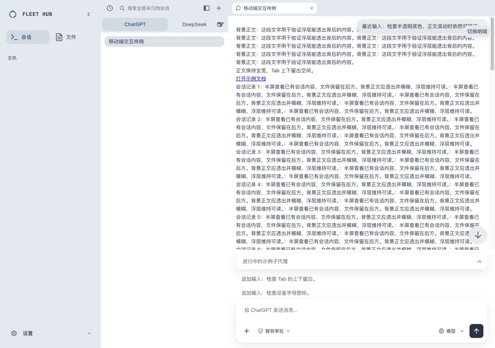
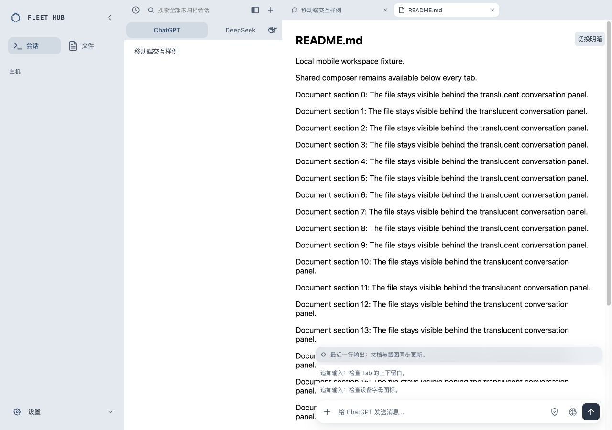

# 三处半透明浮层

2026-10-07。顶部最近输入摘要、跳到底部按钮、文件页最近输出摘要共用独立--chat-floating-bg：主题surface-2的72%透明混合，18px backdrop blur；无边框。浮层与普通用户气泡颜色分离，避免主题重构将浮层变成实色。跳转按钮hover继续保留透明通道。

原因：旧chat-user-bg被Titanium主题映射至不透明surface-2，pin和jump虽仍有blur但采样被实色覆盖；文件摘要94%的白/黑表面也过于接近实色。当前变更只针对上述三处，展开正文面板仍沿用94%主题表面。

本地真实CSS和组件，虚构长正文穿过浮层验证采样。1280×900桌面明暗、390×844手机通过；三处computed background alpha为0.72，blur18px、border0，祖先无backdrop/filter/opacity采样隔离。手机无横向溢出，warning/error为0。数据见[computed-styles.json](computed-styles.json)。

浮层共享透明令牌回归先观察失败（缺少独立alpha令牌），修正后通过；现有composer背景独立层回归仍通过。完整bash scripts/verify.sh退出0，Dashboard276/276、Go与shell层通过，见[verify.txt](verify.txt)。本次仅源码与隔离本地验证，未部署生产。

