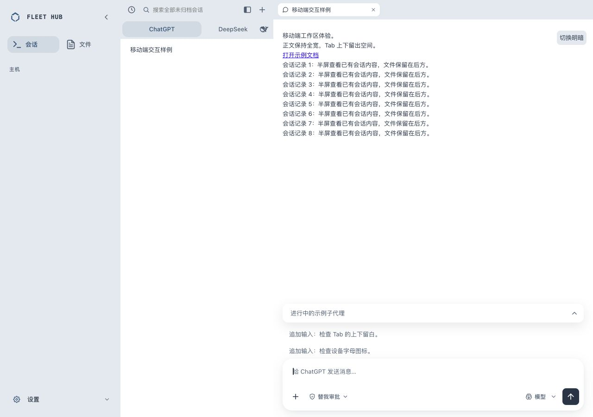
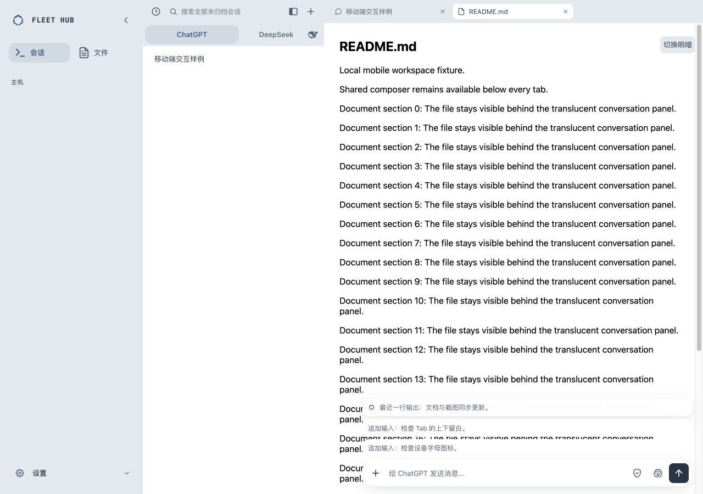

# 输入区统一无描边轻阴影

2026-10-07。移除聊天输入区focus-within钢蓝outline，聚焦时保留原有shadow。聊天、文件小输入区共用--chat-composer-shadow，两层柔和阴影；浅色5.5%/8%、暗色16%/24%。文件展开及收起使用同一shadow，不改变上一轮锚定位置。

本地浏览器实测1280×900与390×844，检查聊天聚焦、文档收起及聚焦展开、明暗主题。各状态border宽度0、outline样式none、box-shadow完全一致（同主题），手机无横向溢出，文件输入44px；控制台warning/error为0。真实computed style见[computed-styles.json](computed-styles.json)。

完整bash scripts/verify.sh退出0，Dashboard275/275、Go与shell层通过，原始输出见[verify.txt](verify.txt)。本次仅源码与隔离本地验证，未部署生产。

