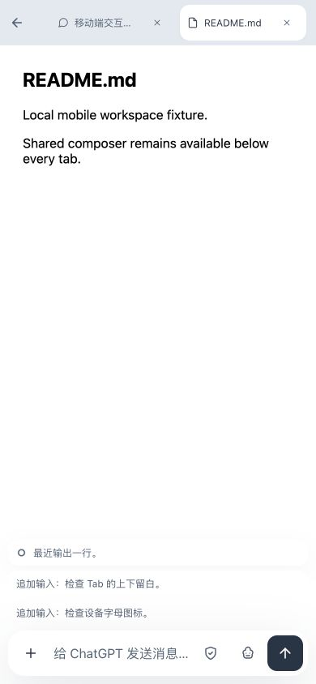
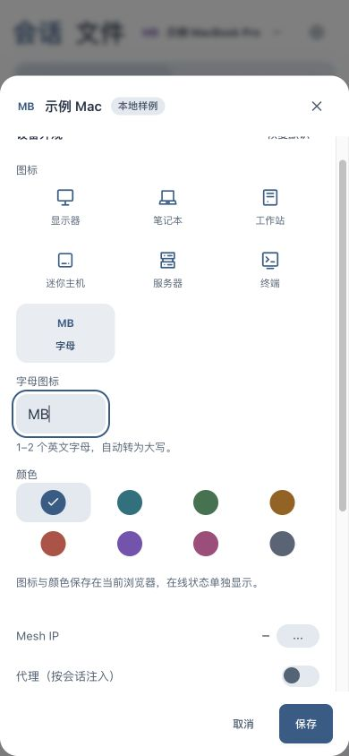

# 移动端体验检查 v181

2026-10-07，生产 Web 提交 `dcb68df`，入口 https://fleet.hyposomnia.top:20443/ 。只发布 Dashboard 的移动布局和字母预览修复，不包含多用户或原生客户端开发。

## 调整

| 区域 | 原表现 | 当前表现 |
|---|---|---|
| 移动助手切换栏 | 继承 flex-basis:128px，按钮高120px | 外壳52px、内容44px，两项等宽 |
| 会话与文件 Tab | 44px Tab 贴满44px标题栏 | 56px标题栏，上下6px留白，Tab/关闭44px，统一12px圆角 |
| 窄屏顶部 | 320px宽下设备名挤出菜单和搜索 | 弹性设备名省略，菜单与搜索保持14px左右留白 |
| 设备选择器设置入口 | 30px触摸目标 | 44×44px |
| 设备设置保存 | 36px高 | 至少44px高 |
| 字母设置 | 提示在输入右侧碎片换行；选项预览滞留A | 提示独立一行；字母选项随输入同步 |

保持灰底、白色选中工作区 Tab、设备选中的灰蓝底与蓝字；无新增边框或 hover 效果。桌面标题栏仍为42px。

## 验证

完整 `bash scripts/verify.sh`：Dashboard 270/270，Go agent/enroll、shell检查均通过，输出见 [verify.txt](verify.txt)。字母预览回归测试先失败，再修复通过。

浏览器检查采用320、390、430、768px视口及1280px桌面回归。原128px助手高度、44px贴边标题栏及320px顶部溢出均在生产页面复现；修复后本地样例和真实线上复测通过。尺寸记录：[geometry.json](geometry.json)、[production-geometry.json](production-geometry.json)。

- 真实线上：四档助手高度52px，菜单/搜索右侧留白14px；助手切换后的选中样式一致。
- 真实线上：单/多Tab高度56px、Tab顶部6px；关闭文件回到聊天仍同高，关闭按钮44×44px。
- 真实线上：设备设置入口44×44px；字母输入自动大写、选项MB与标题MB一致，M1禁止保存，正常输入不显示错误；保存44px高、输入字号16px。测试未保存设备外观。
- 真实线上：320px文件页输入框仍全宽且控件44px；聚焦展开、点击文件Tab失焦收起；模型与权限菜单为全宽底部菜单，动画结束后处于视口内，未更改模型/权限或发送消息。
- 独立样例：多行草稿在收起时保留，两个追加输入分别占行；文件Tab显示最近输出与运行标记，隐藏Sub Agent。真实历史会话检查了完成状态摘要；运行/未读/队列语义另由既有compact_composer测试覆盖。
- 桌面回归：1280px标题仍42px，设备图标仍22px；移动端不出现设备hover卡或桌面侧栏收起入口。

验证覆盖浏览器视口与交互，未做真实iOS软键盘或PWA安全区实机验收。浏览器视口已恢复，临时草稿/选项已清理，未修改设备配置。

生产109个静态文件SHA一致，api运行时节点数据保留，nginx/fleet-enroll/headscale/fleet-nodes.timer均active，无服务重启。备份及部署输出见 [deploy.txt](deploy.txt)。

## 样例效果

以下使用真实CSS/组件与虚构内容，避免将私有会话发布到文档。

