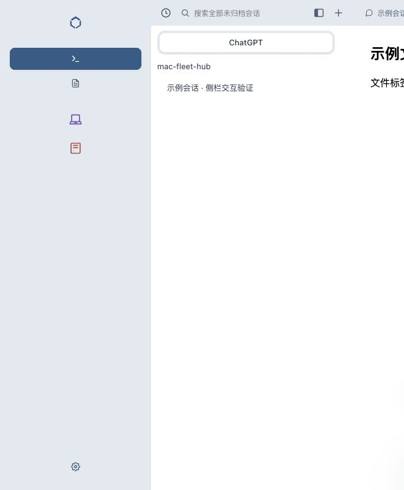

# 灰色设备栏

桌面设备栏沿用顶部的 `--workspace-header-bg` 表面令牌，收起时隐藏文字不再占布局宽度，Logo、会话/文件、设备及设置控件沿统一中线对齐。保留设备颜色、选中态、标题提示与 aria-label，展开状态继续显示名称。

Chrome 隔离预览实际测量：

- 收起栏宽 72px，中心线 x=36px。
- Logo、两种模式、两台示例设备和设置共 6 个图标的中心全部为 x=36px。
- 设备栏和工作区顶部实际背景同为 `rgb(227, 233, 239)`。
- 展开后设备名称计算样式恢复 `display:block`，灰底保留。

`bash scripts/verify.sh` 退出码 0，全部验证通过；网页测试 303 通过、0 失败，Go、Swift、shell 检查通过。原始输出见 [verify.txt](verify.txt)。本次不为纯 CSS 微调新增镜像测试。

静态隔离预览未连接真实设备，本次没有生产部署，符合当前 AGENTS.md 的本地验证范围。

