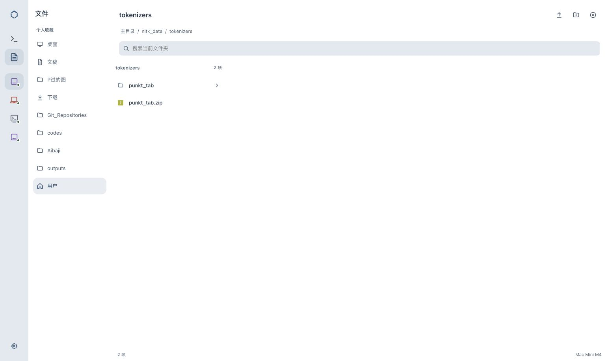

# 侧栏图标尺寸统一 · v178

2026-10-07 已上线，发布提交 `9c8cf5c`。会话/文件图标与设备 SVG 同为22×22px；收起按钮和设备行同为48×42px，12px圆角，中心x=36。

执行 `bash scripts/verify.sh`：Go 通过，Dashboard 259项通过、0失败，脚本检查全部通过。完整输出见 [verify.txt](verify.txt)。

107个线上静态文件SHA256全部匹配，运行时设备数据存在，nginx/fleet-enroll/headscale/fleet-nodes.timer 全部active。备份 `/var/backups/mac-fleet-hub/dashboard-before-v178-20261007T054638Z.tgz`，回执见 [deploy.txt](deploy.txt)。

在用户实际文件页 tokenizers 核对 DOM 尺寸：会话/文件及4个设备 SVG均22×22px；文件按钮与当前设备均48×42px，中心一致、圆角12px。样式加载style.css?v=178。未操作文件或发送消息。

