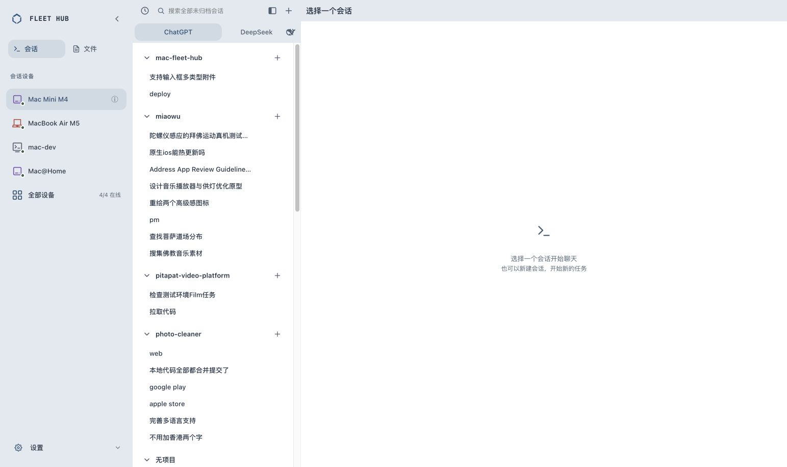

# 统一导航选中态 · v177

2026-10-07 已上线。发布提交 `c550508`。

用户指定以 Mac Mini M4 的设备选中样式为基准：会话/文件模式、ChatGPT/DeepSeek 助手、设备统一浅灰蓝底、蓝色文字、12px 圆角，无边框，无阴影；移动端采用同一视觉语言。

`bash scripts/verify.sh`：Go 测试通过；Dashboard 259 项通过、0 失败；全部脚本层通过。见 [verify.txt](verify.txt)。

生产静态资源107项SHA256一致，设备运行时数据保留，nginx/fleet-enroll/headscale/fleet-nodes.timer 全部 active，缓存 fleet-shell-v177。备份 `/var/backups/mac-fleet-hub/dashboard-before-v177-20261007T054000Z.tgz`。回执见 [deploy.txt](deploy.txt)。

已登录线上浏览器核对：三处 backgroundColor 均为 `color(srgb 0.172549 0.364706 0.529412 / 0.11)`，文字均为 `rgb(36,77,112)`，borderRadius 均为12px，borderWidth 为0px，boxShadow 为none。切换 DeepSeek 核对其包裹外壳相同，恢复 ChatGPT。390px 移动端助手选中相同且无横向溢出；临时视口已恢复。

