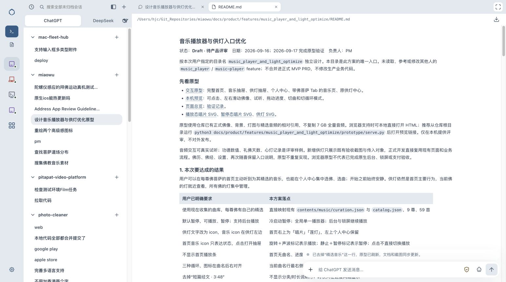
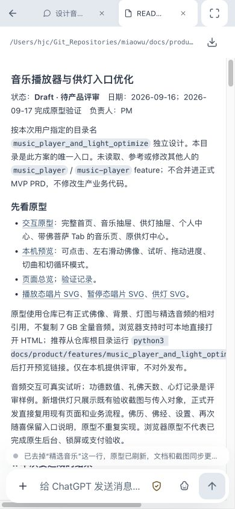

# Web v176 上线验证

发布时间：2026-10-07。发布提交：`de6ff13`，入口：https://fleet.hyposomnia.top:20443/。

本次发布单行标题、文件 Tab 紧凑共享输入区、灰色设备栏与铺满会话列表第二行的助手切换。保持当前生产设备及登录协议；只发布 Dashboard 静态资源。

## 自动验证

运行 `bash scripts/verify.sh`，Go agent/enroll 通过；Dashboard 259 项通过、0 失败；shell、shared 安装、空闲迁移、自更新守卫、nginx、变量守卫及 API 重试检查全部通过。完整输出见 [verify.txt](verify.txt)。

## 实际部署

从不可变提交归档发布，107 个静态文件 SHA256 全部匹配；运行时 nodes.json 存在且非空；nginx、fleet-enroll、headscale、fleet-nodes.timer 全部 active。完整回执见 [deploy.txt](deploy.txt)。

备份：`/var/backups/mac-fleet-hub/dashboard-before-v176-20261007T053303Z.tgz`，未包含运行时 api；需要回滚时恢复此静态归档并核对旧版 manifest，设备目录保留。

公网未登录 `curl -sSI --max-time 20 https://fleet.hyposomnia.top:20443/` 返回 HTTP/2 302 到原登录页。

## 已登录浏览器

- 资源地址为 compact_composer.js?v=176、app.js?v=176。
- 设备栏 72px，灰底 rgb(227,233,239)，已检查图标中心 x=36；切换栏与列表同宽 330px，高42px，副标题隐藏。
- 文件 Tab 输入框宽600px、高48px；聚焦430.5px（实际视口861px），失焦48px；多行草稿保留。模型菜单可点击，文件模式 Sub Agent 隐藏。
- 390×844 移动端无横向溢出；四个图标按钮44×44；聚焦展开422px，返回标签后收起。
- 完成/未读及排队状态由行为测试验证；浏览器未发送消息或上传文件。验证草稿已清空，临时视口已恢复。

