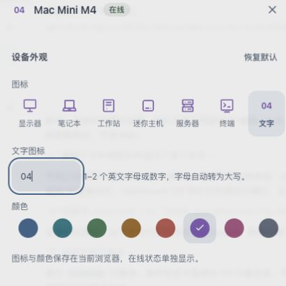
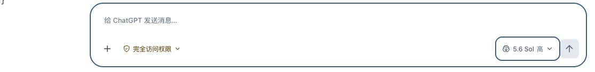

# Web v182 上线回执

2026-10-07，用户授权“两项小改动都上线”。发布提交 `6055ea9`，入口 https://fleet.hyposomnia.top:20443/ 。

本次仅发布兼容现有生产协议的 Dashboard 静态资源：设备文字图标扩展为 1–2 位 ASCII 字母或数字，支持 4、04、A1 并保留前导零；模型按钮采用用户确认的简洁大脑 SVG，线宽 1.8px；缓存版本 v182。未发布共享开发分支的多用户或原生客户端改动。

## 完整验证

发布工作区执行 `bash scripts/verify.sh`，退出码 0。Go agent/enroll 通过，Dashboard 271/271，shell、shared 安装、空闲迁移、自更新、nginx、变量守卫与 API 重试测试全部成功。原始输出见 [verify.txt](verify.txt)。

## 部署及回滚

已提交并推送 main，随后从不可变提交 `git archive 6055ea9:server/dashboard` 打包。部署前核对生产 v181 全部静态哈希，保存备份 `/var/backups/mac-fleet-hub/dashboard-before-v182-20261007T105032Z.tgz`；检查失败会恢复备份。未重启服务，运行时 api/nodes.json 保留且非空。

生产 109 个文件 SHA 全部匹配；nginx、fleet-enroll、headscale、fleet-nodes.timer 全部 active；生产缓存为 fleet-shell-v182。原始回执见 [deploy.txt](deploy.txt)，发布脚本见 [deploy.sh](deploy.sh)，精确静态哈希见 [static.sha256](static.sha256)。

公网未登录 `curl -sSI --max-time 20 https://fleet.hyposomnia.top:20443/` 返回 HTTP/2 302，重定向到原登录入口，见 [http.txt](http.txt)。

## 线上浏览器核验

- 实际加载 app.js?v=182，输入框 pattern 为 [A-Za-z0-9]{1,2}。
- 4、04、a1 即时预览正确，a1 转为 A1，保存按钮可用；M? 禁止保存。
- 04 换色仍保留，保存后刷新显示 04、青碧，SVG 数量为 0；之后恢复原迷你主机图标与紫罗兰颜色。
- 实际会话的大脑 SVG 三条路径与用户选定稿一致，15×15px，计算线宽 1.8px。模型选项及模型列表可正常打开，未修改选定模型或发送消息。
- 浏览器 warning/error 数量为 0。验证用临时标签自动关闭，原用户标签保持原页面。

