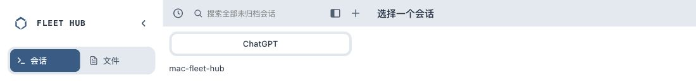

# 工作区顶部栏验证

## 当前单行标题调整（2026-10-07）

- 空状态删除“选择会话开始聊天”副标题，只留“选择一个会话”。
- 所有工作区标题保持单行并垂直居中，长标题截断为省略号。
- `win-meta` 作为隐藏数据节点保留，供已有终端信息与 Tab 悬停详情使用；不占高度，不进入可访问树。
- 两侧顶部栏高度均为 42px，原有灰底、白色选中 Tab 和关闭图标保留。

当前调整仅源码与隔离本地验证，未执行生产部署；遵循当前 AGENTS.md 的本地验证授权范围。

## 实际验证

在当前 `codex/multi-user-server` 工作区执行 `bash scripts/verify.sh`，退出码 0，全部验证通过。原始日志见 [verify.txt](verify.txt)。

Chrome 隔离预览 `http://127.0.0.1:8880/review.html?empty`：

- 工作区和列表工具栏实际高度都是 42px。
- 副标题 `hidden=true`，计算样式 `display:none`。
- 标题实际高度 21.75px，为单行。
- 在 1100px 视口长标题预览中，`white-space:nowrap`、`text-overflow:ellipsis`、`scrollWidth > clientWidth`，确认实际截断。

本地预览是静态布局夹具，未连接真实设备，也未进行账号、创建或删除会话操作。

## 此前顶部栏版本的发布记录

以下是此前任务已经执行的 v175 发布记录，不代表当前单行修订已发布：

- 源码提交 `786adb0`；前一版行为提交 `886a0e8`。
- 发布输出记录：静态资源 105 个 SHA256 匹配，运行时节点数据保留；nginx、fleet-enroll、headscale、fleet-nodes.timer 均 active。
- 备份：`/var/backups/mac-fleet-hub/dashboard-before-v175-20261007T045025Z.tgz`。
- 此前浏览器验证：两侧 42px 同灰底、选中白底、每个 Tab 都有关闭按钮；关闭聊天保留文档，关闭文档后会话记录仍在。
