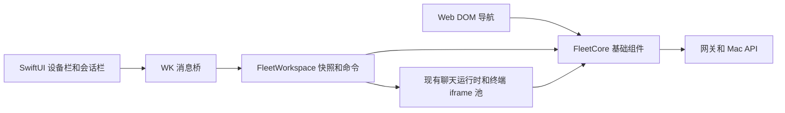

# iOS 与 Web 共享架构

日期：2026-10-04。此实现从 ca68258 创建在 `codex/ios-native-workspace` 分支。本轮同步主工作树 55b673e 的最新 dashboard 与账号前端，保留原生接入；不复制服务器 / Mac 客户端的后端改造，不改动主工作树。详细差异见 [iOS / Web 交互对齐](ios-web-interaction-parity.md)。

## 边界

本轮把可纯测的协议和数据操作移出 app.js：节点规范化、项目归属与分组、列表 query、错误解析和默认权限的 ttyd attach。app.js 的现有函数保留入口，调用 FleetCore；Web 的交互与 PWA 继续维护。FleetWorkspace 提供新的客户端入口，将原生命令转为现有 runtime 操作，不复制审批、writer ownership、持久队列或聊天渲染。

## 快照和命令

`FleetWorkspace.snapshot()` 输出 version=1，包含 ready、identity、devices、sessions、deviceScope、assistant、archived、loading、hasMore、errors、gatewayDown、selectedID、title 和 renderer。session 的 projectKey 来自共享项目模型，避免同名目录合并。快照不包含消息正文或认证材料。

`subscribe(listener)` 只在有订阅者时启动检查，内容变化才发布。身份丢失时清空设备、会话、标题和错误；iOS 同时清空原生状态。页面卸载撤销订阅，返回前台刷新 roster 与列表。

`execute(command, options)` 支持 device、assistant、view、collapse-project、search、archive、more、refresh、open、new、action、host、settings、automation、dismiss-overlay、back、files、sessions、page、theme、logout。普通客户端默认不启用 ttyd；原生桥显式设置 allowTerminal。终端要求可访问且在线的具体设备、允许的助手、仍在当前列表中的会话，以及同源同设备的终端 URL。桥串行处理命令，并以请求 id 确认结果，原生超时反馈不伪装成成功。

## 会话窗口

SwiftUI 始终持有一份 WebView。实际可用宽度至多 860 时列表 / 会话单栏切换，861–1180 时为 220 / 310 的三栏，超过 1180 时为 260 / 330 的三栏；所有变化不重新导航。聊天通过同一个 app-server 与现有 Fleet writer 规则工作。Claude attach 调用 `/mN/api/open`，新建调用 `/mN/api/new`，返回终端 URL 进入现有池。重复打开同一 ttyd 会话复用池条目，不额外创建连接。

缓存聊天的队列轮询、SSE、历史和 skills 按 chat.assistant 绑定，不跟随全局助手筛选变化。否则切到 Claude 后，缓存的 Codex 会话会错误查询 Claude backend。Web 在跨越移动断点时同步会话窗口的显示状态，App 嵌入布局使用独立 CSS。

## 与多用户分支合并

保留多用户分支的 FleetAuth 初始化、CSRF transport、身份命名空间和 `/api/devices` scoped route；不要回退到公开/全局节点列表。FleetCore.normalizeDevices 已支持 scoped devices 和 legacy Headscale nodes 两种数据形状，只处理数据，不决定权限。共享 transport 接收当前 fetch 函数，FleetAuth 的同源、Cookie、CSRF 和失效处理仍然生效。

合并 index.html 时按顺序加载 fleet_core → app → workspace → native_bridge，并保留多用户 auth-client.js 在 app 之前，以及 sidebar_layout / workspace_tabs 的 Web 组件。合并 service worker 时保留账户敏感路径排除规则，并同步所有壳资源版本。原生认证判断识别 FleetAuth.user 与 auth-expired 状态，不自行请求或保存认证令牌。

## 测试与后续拆分

`scripts/verify.sh` 包含共享组件测试和原有 Go、dashboard、shell 测试。iOS XCTest 验证断点、网关验证、origin 与身份失效；XCUITest 使用真实 dashboard 加模拟 API 验证列表、聊天、ttyd、旋转和侧栏。浏览器 smoke 补充 Web 可见性、嵌入隔离和缓存 backend 归属。

后续可逐步将 app.js 的 API 调用和 runtime 生命周期迁入模块，再让 Web DOM 通过 FleetWorkspace 的命令与事件维护导航。每次迁移保持现有 Web 回归，不在本轮同时改动 writer 协议、网关认证和 agent 发布流程。
